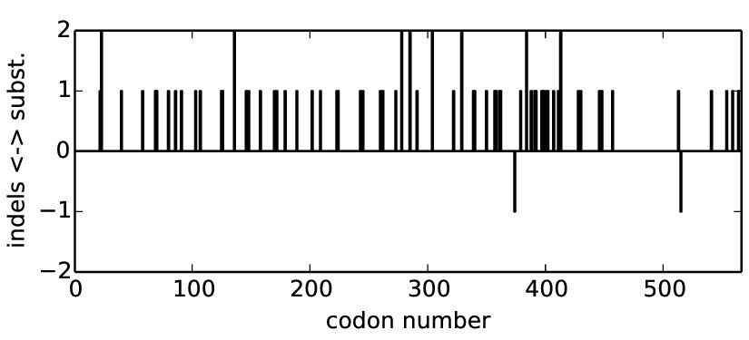
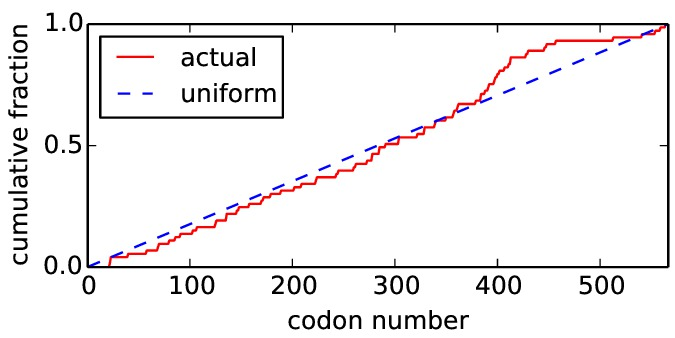
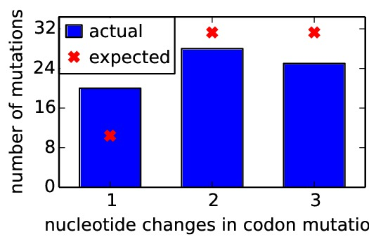
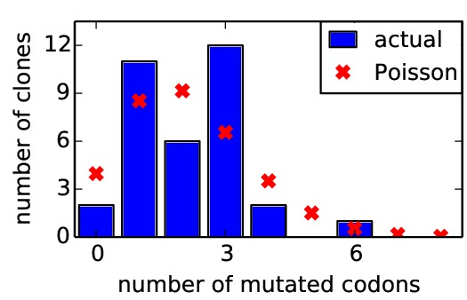
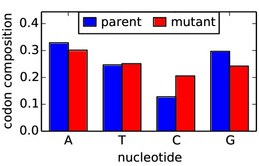
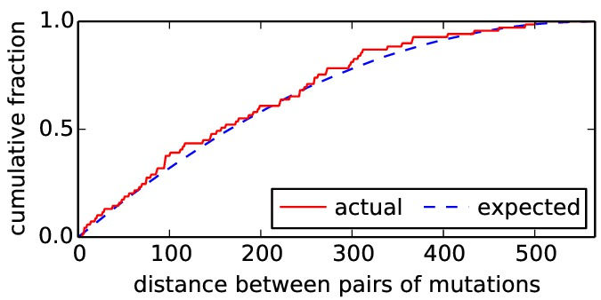

=============================
SangerMutantLibraryAnalysis
=============================

Summary
-----------

This is a script for analyzing the distribution of mutations among Sanger-sequenced clones in a mutant library of a protein-coding gene. The distributions of mutations are analyzed and plotted.

The script for this analysis is available `on GitHub`_.

This script was written by `Jesse Bloom`_.

Analyses
----------
Here are the analyses (each in its own subdirectory) performed with this script:

* ``2013Analysis_Influenza_NP_Aichi68`` contains the results of analyzing a mutant library of the A/Aichi/2/1968 (H3N2) influenza gene. Analysis performed by `Jesse Bloom`_ using `SangerMutantLibraryAnalysis v0.21`_.

* ``2014Analysis_Influenza_HA_WSN`` contains the results of analyzing a mutant library of the A/WSN/1933 (H1N1) influenza gene. Analysis performed by `Jesse Bloom`_ using `SangerMutantLibraryAnalysis v0.2`_.

Requirements
---------------

This analysis simply consists of a `Python`_ script. It has been tested with `Python`_ versions 2.6 and 2.7, and probably works with other 2.* versions as well. 

The script requires `scipy`_ and `matplotlib`_. It has been tested with `scipy`_ 0.12.0 and `matplotlib`_ version 1.2.1, but will probably work with other versions as well.

The script uses `ImageMagick convert`_ to convert ``*.pdf`` files to ``*.jpg`` files.

Running the script
-----------------------

The analysis is performed by the script *analyze_library.py*. To run the script, simply go to the current directory and type the command::

    python analyze_library.py

The script will then ask you to enter the names of two input files: the sequence file, and the mutation list file. These are both text files that should have the following format:

    * **The sequence file:** this is simply a FASTA file that contains a single protein-coding gene. This should be the gene that you are sequencing. For example, here is an example of such a file (``Aichi68-NP.fasta``)::

        >WSN-HA
        ATGAAGGCAAAACTACTGGTCCTGTTATATGCATTTGTAGCTACAGATGCAGACACAATATGTATAGGCTACCATGCGAACAACTCAACCGACACTGTTGACACAATACTCGAGAAGAATGTGGCAGTGACACATTCTGTTAACCTGCTCGAAGACAGCCACAACGGGAAACTATGTAAATTAAAAGGAATAGCCCCACTACAATTGGGGAAATGTAACATCACCGGATGGCTCTTGGGAAATCCAGAATGCGACTCACTGCTTCCAGCGAGATCATGGTCCTACATTGTAGAAACACCAAACTCTGAGAATGGAGCATGTTATCCAGGAGATCTCATCGACTATGAGGAACTGAGGGAGCAATTGAGCTCAGTATCATCATTAGAAAGATTCGAAATATTTCCCAAGGAAAGTTCATGGCCCAACCACACATTCAACGGAGTAACAGTATCATGCTCCCATAGGGGAAAAAGCAGTTTTTACAGAAATTTGCTATGGCTGACGAAGAAGGGGGATTCATACCCAAAGCTGACCAATTCCTATGTGAACAATAAAGGGAAAGAAGTCCTTGTACTATGGGGTGTTCATCACCCGTCTAGCAGTGATGAGCAACAGAGTCTCTATAGTAATGGAAATGCTTATGTCTCTGTAGCGTCTTCAAATTATAACAGGAGATTCACCCCGGAAATAGCTGCAAGGCCCAAAGTAAGAGATCAACATGGGAGGATGAACTATTACTGGACCTTGCTAGAACCCGGAGACACAATAATATTTGAGGCAACTGGTAATCTAATAGCACCATGGTATGCTTTCGCACTGAGTAGAGGGTTTGAGTCCGGCATCATCACCTCAAACGCGTCAATGCATGAGTGTAACACGAAGTGTCAAACACCCCAGGGAGCTATAAACAGCAATCTCCCTTTCCAGAATATACACCCAGTCACAATAGGAGAGTGCCCAAAATATGTCAGGAGTACCAAATTGAGGATGGTTACAGGACTAAGAAACATCCCATCCATTCAATACAGAGGTCTATTTGGAGCCATTGCTGGTTTTATTGAGGGGGGATGGACTGGAATGATAGATGGATGGTATGGTTATCATCATCAGAATGAACAGGGATCAGGCTATGCAGCGGATCAAAAAAGCACACAAAATGCCATTAACGGGATTACAAACAAGGTGAACTCTGTTATCGAGAAAATGAACACTCAATTCACAGCTGTGGGTAAAGAATTCAACAACTTAGAAAAAAGGATGGAAAATTTAAATAAAAAAGTTGATGATGGGTTTCTGGACATTTGGACATATAATGCAGAATTGTTAGTTCTACTGGAAAATGAAAGGACTTTGGATTTCCATGACTTAAATGTGAAGAATCTGTACGAGAAAGTAAAAAGCCAATTAAAGAATAATGCCAAAGAAATCGGAAATGGGTGTTTTGAGTTCTACCACAAGTGTGACAATGAATGCATGGAAAGTGTAAGAAATGGGACTTATGATTATCCAAAATATTCAGAAGAATCAAAGTTGAACAGGGAAAAGATAGATGGAGTGAAATTGGAATCAATGGGGGTGTATCAGATTCTGGCGATCTACTCAACTGTCGCCAGTTCACTGGTGCTTTTGGTCTCCCTGGGGGCAATCAGTTTCTGGATGTGTTCTAATGGGTCTTTGCAGTGCAGAATATGCATCTGA 

    * **The mutation list file:** this is a text file that lists the mutations. The mutations should be numbered in sequential (1, 2, ...) numbering according to the sequence specified in the sequence file. Lines in this file that are empty or begin with the character # are ignored. All other lines should specify a clone and all identified mutations. The clone name should be the first entry on the line, followed by a colon. There is then a comma-delimited list of the mutations. The mutations are indicated as follows:

        * Single nucleotide substitutions are indicated as *G1378T* for mutation of site 1378 from *G* to *T*.

        * Multiple-nucleotide mutations at the same codon should be listed as *AG349GA* or *TCT1003GCC*. List mutations like this if they are sequential (or two mutations separated by a single other mutation) as these are probably mutations of the same codon.

        * Deletions should be listed like this: *delC392* for deletion of the *C* at position 392.

        * Insertions should be listed like this: *insG392* for insertion of a *G* at position 392.

        * If a clone has not mutations, you should enter *None*.

      The script will check that the specified wildtype nucleotides actually match thos e indicated in the sequence file. If they do not, an error will be raised. Note that even if your sequence contains an insertion or deletion, you must ensure that subsequent sites are still numbered according to sequential numbering of the provided sequence.

      Here is an example input file::

        # Sequencing results for 3 WSN-HA mutation libraries. 
        # Results from Aug-28 2013 ans Sept-3 2013.
        # Twelve single colonies analyzed for each library replicate with 3 primers. 
        # Total 36 samples.  

        1-1: AAG406GAT, GA1342AG
        1-2: GTA442TAC, AAC667GCT, AAC853GGA
        1-3: ATG1204GTC
        1-4: G373A, G510T
        1-5: AAT118TTG, GGT784CGC, CA1220AT
        1-6: GCA778TAC, TT1019CG, ATA1081GGG, A1370C
        1-7: AGG670TCC, A1232T, delA1544
        1-8: None

        1-9: AAT535GAG
        1-10: ACA1150TAC, ATT1171CCG, GTT1192CTA
        1-11: C1175A
        1-12: TC566AT, C855T, C912T
        2-1: CTA172AGG, TC1238AT, T1675G
        2-2: GCT1048CAC
        2-3: AGC472TTT, TAT733CTG, G1070A
        #2-4: mixed template, clearly colony is actually two different mutants 

        2-5: TCA256CCC, GA832CG, AGG985CGT
        2-6: T818A, G834A, GG1288TC
        2-7: TTC1237AAT
        2-8: GA307CG, T1086A, AG1199GC
        2-9: GGC67CAG, insG1121, AGG1537TAC
        2-10: GG238AC, TGT319CAA, AAG406GAC, C1136A, AA1337TG, GT1621TC
        2-11: A64G, GGG208AAT, ATG727TCA, GG986CC
        2-12: TGT871AAA, TGT1660GAG, TG1690AT
        3-1: G207T

        3-2: None
        3-3: ACA1150TAC

        3-4: AAC436TAT, T964G, TCT1189GTA
        3-5: GA272TC, TCC1015CAG

        3-6: TCA376ACT, T1074G, A1283T
        3-7: G67C
        3-8: GAT514TAG

        #3-9: bad sequencing read with forward primer
        3-10: AG625CT, AGC910TTT
        3-11: T606G
        3-12: ATT1162CTA

Output of the script
----------------------

The script will print some information about the mutation statistics to standard output. It will also create some PDF plot files. For example, running the script using the example sequence file *Aichi68-NP.fasta* and the example mutation list *mutation_list.txt* provided with this script `on GitHub`_ will produce the following information printed to standard output::

    Beginning analysis.

    Enter the name of the FASTA file containing the gene sequence: WSN-HA.fasta
    Read a coding sequence of length 1698

    Enter the name of the file containing the list of mutations: wsn_mutations_090413.txt

    Reading mutations from wsn_mutations_090413.txt
    Read entries for 34 clones

    Substitutions begin at following positions: 22, 23, 23, 40, 58, 69, 70, 80, 86, 91, 103, 107, 125, 126, 136, 136, 146, 148, 158, 170, 172, 179, 189, 202, 209, 223, 224, 243, 245, 260, 262, 273, 278, 278, 285, 285, 291, 304, 304, 322, 329, 329, 339, 340, 350, 357, 358, 361, 362, 379, 384, 384, 388, 391, 392, 397, 398, 400, 402, 407, 411, 413, 413, 428, 430, 446, 448, 457, 513, 541, 554, 559, 564

    Indels begin at following positions: 374, 515

    Found a total of 73 substitutions out of 19244 codons sequenced (0.0038)

    Here are the fractions with different numbers of nucleotide mutations:
      1 nucleotide mutations: 0.00104
      2 nucleotide mutations: 0.00145
      3 nucleotide mutations: 0.00130

    Here are the fractions of mutation types
      synonymous: 0.00026
      nonsynonymous: 0.00353
      stop codon: 0.00000

    Now creating the output PDF plot files...
    The output PDF file plots have now all been created.

    Script complete

The produced PDF files are as follows:

   The above plot ``mutpositions.pdf`` uses lines to show the locations of point mutations and insertions and deletions along the primary sequence.

   The above plot ``mutpositions_cumulative.pdf`` shows the cumulative distribution of substitution mutations along the primary sequence versus the line expected for a uniform distribution of mutations.

   The above plot ``ncodonmuts.pdf`` shows the average number of nucleotide changes for each codon substitution mutation versus the expectation if each codon is equally likely to be mutated to every other codon.

   The above plot ``nmutdist.pdf`` shows the distribution of the number of codon substitution mutations per clone versus the expectation for a Poisson distribution.

   The above plot ``codonmutntcomposition.pdf`` shows the nucleotide composition (fraction of each of the nucleotides) in the parent and mutant codons for each mutation. If your library is totally unbiased for every codon mutating to every other codon with equal probability, the parent composition should be equal to the nucleotide composition of your gene (which is probably not exactly 25% of each nucleotide), whereas the mutant composition should be very close to 25% of each nucleotide.

   The above plot ``mutationclustering.pdf`` helps you determine if mutations are clustered in primary sequence in clones with multiple substitutions. This plot is less intuitive than the others. For every clone with multiple mutations, the pairwise distance between those mutations in primary sequence is computed. The actual cumulative distribution of these pairwise distances is shown. The script then simulates sets of clones that have the exact same number of mutations per clone as observed in the actual mutation list with these mutations located randomly in primary sequence. It then computes the cumulative distribution of the pairwise distances for 1000 of these simulated libraries, and plots that. If the two distributions look similar, you library probably does not have a tendency for clustering of mutations in primary sequence. If the distributions are different, such clustering may exist.

.. _`on GitHub`: https://github.com/jbloom/SangerMutantLibraryAnalysis
.. _`Jesse Bloom`: http://research.fhcrc.org/bloom/en.html
.. _`Python`: http://www.python.org/
.. _`scipy`: http://www.scipy.org/
.. _`matplotlib`: http://matplotlib.org/
.. _`ImageMagick convert` : http://www.imagemagick.org/script/convert.php
.. _`SangerMutantLibraryAnalysis v0.2`: https://github.com/jbloom/SangerMutantLibraryAnalysis/tree/v0.2
.. _`SangerMutantLibraryAnalysis v0.1`: https://github.com/jbloom/SangerMutantLibraryAnalysis/tree/v0.1
